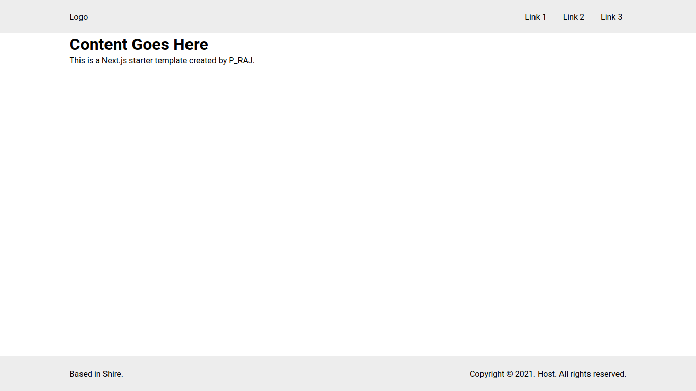

# P_RAJ Starter Template

## What's in the template?

---

The template contains a grid based standard layout having a fixed navigation bar and a variable height content section appended by a footer.

Note: The layout is not responsive.

## How is it useful?

---

The starter layout eases the load of clean up process which is usually performed by developers after having bootstrapped a project. In addition to that, the Layout component is defined for all the pages in the `_app.js` file.

The Layout component is location in the `components/layout` directory. The directory also contains separate files for `Navbar` and `Footer`.
